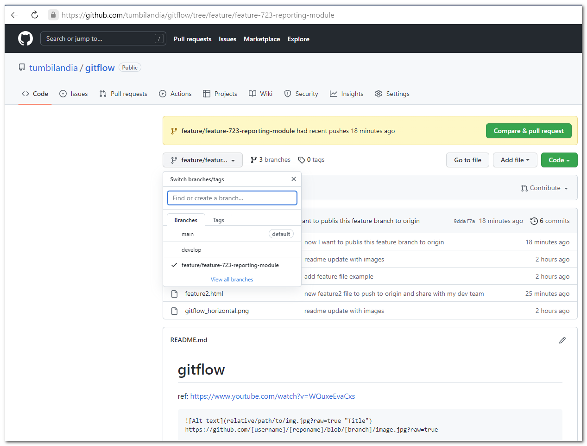

# gitflow

ref: https://www.youtube.com/watch?v=WQuxeEvaCxs

```

https://github.com/[username]/[reponame]/blob/[branch]/image.jpg?raw=true
```


1. Create repo in GitHub
2. clone it locally

```
    ❯ git clone https://github.com/tumbilandia/gitflow.git
    Cloning into 'gitflow'...
    remote: Enumerating objects: 3, done.
    remote: Counting objects: 100% (3/3), done.
    remote: Total 3 (delta 0), reused 0 (delta 0), pack-reused 0
    Receiving objects: 100% (3/3), done.
```
3. $ git flow init

```
    ❯ git flow init

    Which branch should be used for bringing forth production releases?
    - main
    Branch name for production releases: [main]
    Branch name for "next release" development: [develop]

    How to name your supporting branch prefixes?
    Feature branches? [feature/]
    Bugfix branches? [bugfix/]
    Release branches? [release/]
    Hotfix branches? [hotfix/]
    Support branches? [support/]
    Version tag prefix? []
    Hooks and filters directory? [D:/_dev/_repos/gitflow-on-github/gitflow/.git/hooks]
```
4. $ git push --set-upstream origin develop

```shell
    ❯ git push --set-upstream origin develop
    Total 0 (delta 0), reused 0 (delta 0), pack-reused 0
    remote:
    remote: Create a pull request for 'develop' on GitHub by visiting:
    remote:      https://github.com/tumbilandia/gitflow/pull/new/develop
    remote:
    To https://github.com/tumbilandia/gitflow.git
    * [new branch]      develop -> develop
    Branch 'develop' set up to track remote branch 'develop' from 'origin'.
```

5. $ git flow feature start feature/
  * [Git branch naming conventions](https://deepsource.io/blog/git-branch-naming-conventions/)
<!--
  * Git branch naming conventions [https://deepsource.io/blog/git-branch-naming-conventions/](https://deepsource.io/blog/git-branch-naming-conventions/)
  * Git branch naming conventions [https://deepsource.io/blog/git-branch-naming-conventions/]
  * A continuación se muestra un [Link](https://ejemplo.com/ "Título opcional del enlace")
-->
<!--


![Alt text][img|320x271](branch-naming-example.png?raw=true "Git branch naming conventions")


-->

  


    -> git flow feature start feature-722-summary-module
```
    ❯ git flow feature start feature-722-summary-module
    Switched to a new branch 'feature/feature-722-summary-module'
    M       README.md

    Summary of actions:
    - A new branch 'feature/feature-722-summary-module' was created, based on 'develop'
    - You are now on branch 'feature/feature-722-summary-module'

    Now, start committing on your feature. When done, use:

        git flow feature finish feature-722-summary-module
```

    -> create new file (powershell)
```
    ❯ new-item feature.html -type file
        Directory: D:\_dev\_repos\gitflow-on-github\gitflow

    ❯ git commit -a -m"add feature file example"
    [feature/feature-722-summary-module d609f1e] add feature file example
    2 files changed, 7 insertions(+), 3 deletions(-)
    create mode 100644 feature.html
```


6. $ git flow feature finish feature_

~~~
    ❯ git commit -a -m"add feature file example"
    [feature/feature-722-summary-module d609f1e] add feature file example
    2 files changed, 7 insertions(+), 3 deletions(-)
    create mode 100644 feature.html
    ⚡ rra12@MANGO  D:\_dev\_repos\gitflow-on-github\gitflow   feature/feature-722-summary-module ≢                                                                        [06:37]

    ❯ git flow feature finish feature-722-summary-module
    Switched to branch 'develop'
    Your branch is up to date with 'origin/develop'.
    Updating 85b75b7..d609f1e
    Fast-forward
    README.md    | 10 +++++++---
    feature.html |  0
    2 files changed, 7 insertions(+), 3 deletions(-)
    create mode 100644 feature.html
    Deleted branch feature/feature-722-summary-module (was d609f1e).

    Summary of actions:
    - The feature branch 'feature/feature-722-summary-module' was merged into 'develop'
    - Feature branch 'feature/feature-722-summary-module' has been locally deleted
    - You are now on branch 'develop'


    ❯  git branch -a
    * develop
    main
    remotes/origin/HEAD -> origin/main
    remotes/origin/develop
    remotes/origin/main

    ❯ git push origin
    Enumerating objects: 6, done.
    Counting objects: 100% (6/6), done.
    Delta compression using up to 12 threads
    Compressing objects: 100% (3/3), done.
    Writing objects: 100% (4/4), 604 bytes | 604.00 KiB/s, done.
    Total 4 (delta 1), reused 0 (delta 0), pack-reused 0
    remote: Resolving deltas: 100% (1/1), completed with 1 local object.
    To https://github.com/tumbilandia/gitflow.git
    85b75b7..d609f1e  develop -> develop
~~~
7. $ git flow feature publish
~~~
    ❯ git branch -a
    develop
    * feature/feature-723-reporting-module
    main
    remotes/origin/HEAD -> origin/main
    remotes/origin/develop
    remotes/origin/main

    ❯ git flow feature publish feature-723-reporting-module
    Enumerating objects: 9, done.
    Counting objects: 100% (9/9), done.
    Delta compression using up to 12 threads
    Compressing objects: 100% (7/7), done.
    Writing objects: 100% (7/7), 1.13 KiB | 1.13 MiB/s, done.
    Total 7 (delta 3), reused 0 (delta 0), pack-reused 0
    remote: Resolving deltas: 100% (3/3), completed with 1 local object.
    remote:
    remote: Create a pull request for 'feature/feature-723-reporting-module' on GitHub by visiting:
    remote:      https://github.com/tumbilandia/gitflow/pull/new/feature/feature-723-reporting-module
    remote:
    To https://github.com/tumbilandia/gitflow.git
    * [new branch]      feature/feature-723-reporting-module -> feature/feature-723-reporting-module
    Branch 'feature/feature-723-reporting-module' set up to track remote branch 'feature/feature-723-reporting-module' from 'origin'.
    Already on 'feature/feature-723-reporting-module'
    Your branch is up to date with 'origin/feature/feature-723-reporting-module'.

    Summary of actions:
    - The remote branch 'feature/feature-723-reporting-module' was created or updated
    - The local branch 'feature/feature-723-reporting-module' was configured to track the remote branch
    - You are now on branch 'feature/feature-723-reporting-module'
~~~

<!--  -->


8.  Reference:
   <!--* GitLab official markdown reference [GitLab Flavored Markdown ](https://www.google.com)
   * GitLab official markdown reference (https://docs.gitlab.com/ee/user/markdown.html)    -->
   * [GitLab official markdown reference](https://docs.gitlab.com/ee/user/markdown.html)
   * [List of supported languages and lexers for syntax highlighting](https://github.com/rouge-ruby/rouge/wiki/List-of-supported-languages-and-lexers)
   * [GitFlow in standard way](http://bitacoratl.blogspot.com/2016/11/instalacion-y-uso-de-git-flow.html)
   * [Introducing GitFlow](https://datasift.github.io/gitflow/IntroducingGitFlow.html)