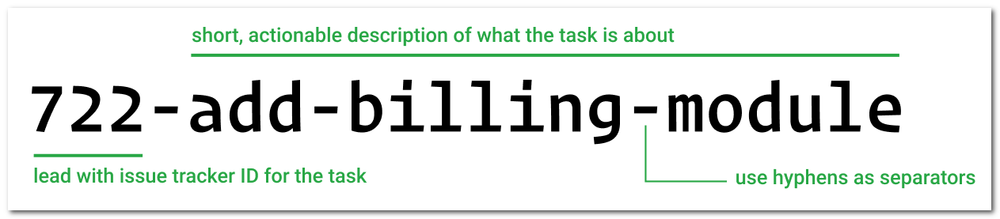

# gitflow

ref: https://www.youtube.com/watch?v=WQuxeEvaCxs

```

https://github.com/[username]/[reponame]/blob/[branch]/image.jpg?raw=true
```


1. Create repo in GitHub
2. clone it locally

```
    ❯ git clone https://github.com/tumbilandia/gitflow.git
    Cloning into 'gitflow'...
    remote: Enumerating objects: 3, done.
    remote: Counting objects: 100% (3/3), done.
    remote: Total 3 (delta 0), reused 0 (delta 0), pack-reused 0
    Receiving objects: 100% (3/3), done.
```
3. $ git flow init

```
    ❯ git flow init

    Which branch should be used for bringing forth production releases?
    - main
    Branch name for production releases: [main]
    Branch name for "next release" development: [develop]

    How to name your supporting branch prefixes?
    Feature branches? [feature/]
    Bugfix branches? [bugfix/]
    Release branches? [release/]
    Hotfix branches? [hotfix/]
    Support branches? [support/]
    Version tag prefix? []
    Hooks and filters directory? [D:/_dev/_repos/gitflow-on-github/gitflow/.git/hooks]
```
4. $ git push --set-upstream origin develop

```shell
    ❯ git push --set-upstream origin develop
    Total 0 (delta 0), reused 0 (delta 0), pack-reused 0
    remote:
    remote: Create a pull request for 'develop' on GitHub by visiting:
    remote:      https://github.com/tumbilandia/gitflow/pull/new/develop
    remote:
    To https://github.com/tumbilandia/gitflow.git
    * [new branch]      develop -> develop
    Branch 'develop' set up to track remote branch 'develop' from 'origin'.
```

5. $ git flow feature start feature_
  * [Git branch naming conventions](https://deepsource.io/blog/git-branch-naming-conventions/)
<!--
  * Git branch naming conventions [https://deepsource.io/blog/git-branch-naming-conventions/](https://deepsource.io/blog/git-branch-naming-conventions/)
  * Git branch naming conventions [https://deepsource.io/blog/git-branch-naming-conventions/]
  * A continuación se muestra un [Link](https://ejemplo.com/ "Título opcional del enlace")
-->
<!--


![Alt text][img|320x271](branch-naming-example.png?raw=true "Git branch naming conventions")


-->
[]

6. Reference:
   <!--* GitLab official markdown reference [GitLab Flavored Markdown ](https://www.google.com)
   * GitLab official markdown reference (https://docs.gitlab.com/ee/user/markdown.html)    -->
   * [GitLab official markdown reference](https://docs.gitlab.com/ee/user/markdown.html)